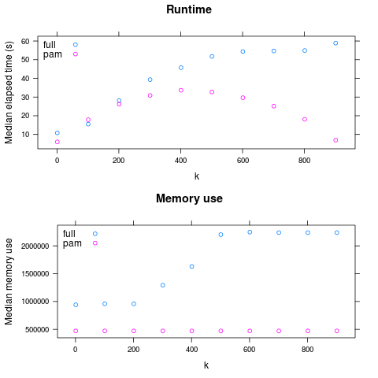

Comparing two algorithms
========================

This is a realistic example of using ``nestly`` to examine the performance of two algorithms. Source code to run it is available in ``examples/adcl/``.

We will use the ``min_adcl_tree`` subcommand of the ``rppr`` tool from the
``pplacer`` suite, available from http://matsen.fhcrc.org/pplacer.

This tool chooses ``k`` `representative leaves from a phylogenetic tree`_.
There are two implementations: the **Full** algorithm solves the problem
exactly, while the **PAM** algorithm uses a variation on the `partitioning
among medoids`_ heuristic to find a solution.

We'd like to compare the two algorithms on a variety of trees, using different values for ``k``.

Making the nest
---------------

Setting up the comparison is demonstrated in ``00make_nest.py``, which builds
up combinations of ``(algorithm, tree, k)``:

.. literalinclude:: ../examples/adcl/00make_nest.py
   :language: python
   :linenos:

Running that:

.. code-block:: sh

   $ ./00make_nest.py

Creates a new directory, ``runs``.

Within this directory are subdirectories for each algorithm::

   runs/full
   runs/pam

Each of these contains a directory for each tree used:

.. code-block:: sh

   $ ls runs/pam
   random001  random002  random003  random004  random005

Within each of *these* subdirectories are directories for each choice of ``k``.

.. code-block:: sh

   $ ls runs/pam/random001
   1  101  201  301  401  501  601  701  801  901

These directories are leaves. There is a JSON_ file in each, containing the choices made. For example,
``runs/full/random003/401/control.json`` contains:

.. code-block:: javascript

   {
     "algorithm": "full", 
     "tree": "/home/cmccoy/development/nestly/examples/adcl/trees/random003.tre", 
     "n_leaves": 1000, 
     "k": 401
   }

Running the algorithm
---------------------

The ``nestrun`` command-line tool allows you to run a command for each combination of parameters in a nest.
It allows you to substitute parameters chosen by surrounding them in curly brackets, e.g. ``{algorithm}``.

To see how long, and how much memory each run uses, we'll use the short shell script ``time_rppr.sh``:

.. literalinclude:: ../examples/adcl/time_rppr.sh
   :language: sh
   :linenos:

Note the placeholders for the parameters to be provided at runtime: ``k``, ``tree``, and ``algorithm``.

Running a script like ``time_rppr.sh`` on every experiment within a nest in parallel is facilitated by the ``nestrun`` script distributed with ``nestly``:

.. code-block:: sh

   $ nestrun -j 4 --template-file time_rppr.sh -d runs

(this will take awhile)

Aggregating results
-------------------

Now we have a little CSV file in each leaf directory, containing the running time::

    |----------+--------+--------+-------------|
    |  elapsed | avgmem | maxmem | exitstatus  |
    |----------+--------+--------+-------------|
    |  17.78   | 0      | 471648 | 0           |
    |----------+--------+--------+-------------|

To analyze these en-masse, we need to combine them and add information about the parameters used to generate them. The ``nestagg`` script does just this.

.. code-block:: sh

   $ nestagg delim -d runs -o results.csv time.csv -k algorithm,k,tree

``results.csv``::

     |----------+--------+---------+------------+-----------+---------------------------------------+------|
     |  elapsed | avgmem | maxmem  | exitstatus | algorithm | tree                                  | k    |
     |----------+--------+---------+------------+-----------+---------------------------------------+------|
     |  17.04   | 0      | 941328  | 0          | full      | .../examples/adcl/trees/random001.tre | 1    |
     |  20.86   | 0      | 944336  | 0          | full      | .../examples/adcl/trees/random001.tre | 101  |
     |  31.75   | 0      | 944320  | 0          | full      | .../examples/adcl/trees/random001.tre | 201  |
     |  39.34   | 0      | 980048  | 0          | full      | .../examples/adcl/trees/random001.tre | 301  |
     |  37.84   | 0      | 1118960 | 0          | full      | .../examples/adcl/trees/random001.tre | 401  |
     |  42.15   | 0      | 1382000 | 0          | full      | .../examples/adcl/trees/random001.tre | 501  |
     etc

Now we have something we can look at!

So: PAM is faster for large ``k``, and always has lower maximum memory use.

(generated by ``examples/adcl/03analyze.R``)

.. _`partitioning among medoids`: http://en.wikipedia.org/wiki/K-medoids

.. _JSON: http://www.json.org

.. _`representative leaves from a phylogenetic tree`: http://matsen.fhcrc.org/general/2012/05/31/adcl-paper.html
